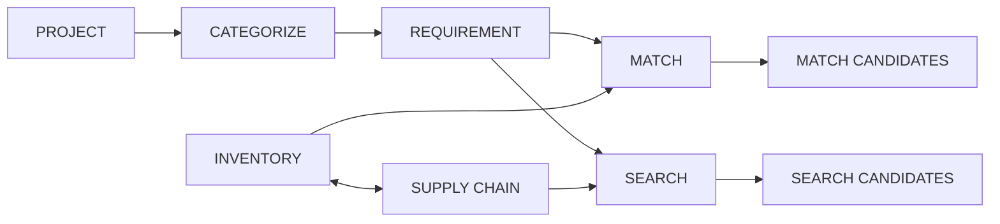
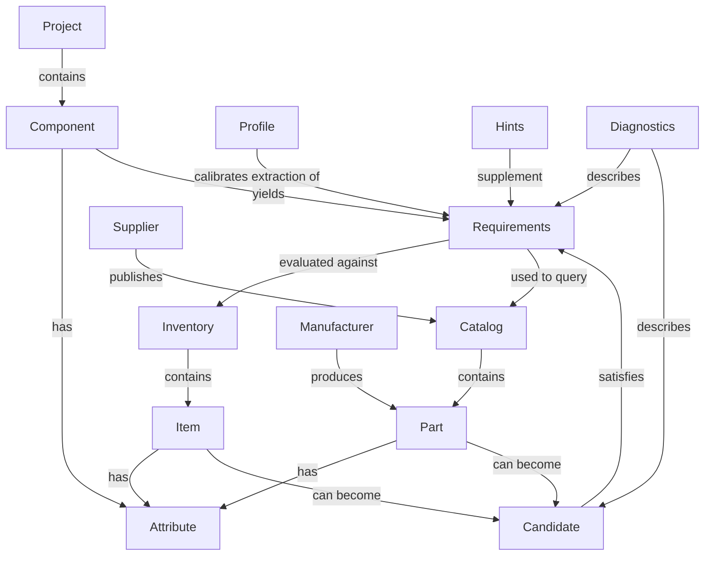
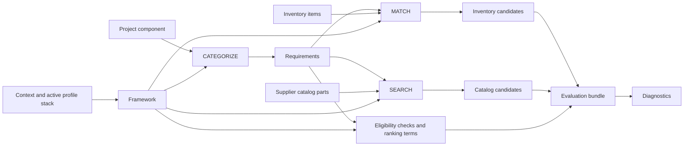

# ADR 0003: Search Heuristic Signal Framework
Date: 2026-03-18
Status: Proposed (awaiting review)
Related: #204
## Problem
jBOM's search and match heuristics are inconsistently hardcoded across multiple files and are incomplete.
Adding and extending heuristics is becoming increasingly difficult as code edits add risk and complexity to an already fragile area.
## Success criteria
- A taxonomy for describing jBOM search/match heuristic actors, artifacts, and behaviors.
- An ontology of actors/behaviors and their relationships.
- A framework design used by all jBOM search and match functionality that:
  - supports new items/categories primarily through config-file changes, not repeated code rewrites
  - removes hardcoded heuristic decision/ranking rules as a scattered implementation pattern
  - supports supplier differences and user preferences through governed configuration
  - achieves match/search fidelity as good as or better than current behavior for Resistors, Capacitors, and LEDs
  - extends support to additional categories such as switches, connectors, and ICs
## EM vs supply-chain boundary
This proposal treats electro-mechanical (EM) sufficiency and supply-chain identity as related but distinct concerns:
- `CATEGORIZE` is project-side only and does not engage supply-chain sources.
- `MATCH` operates on requirements against curated inventory only; it does not directly query supplier catalogs.
- `SEARCH` operates on requirements and supplier catalogs to discover candidates, then can feed curated inventory workflows.
- Inventory is the primary bridge for supply-chain identity and substitution policy.
- Profile-governed heuristics bridge the insufficient -> sufficient -> fully specified EM continuum.
- Fully specified components remain first-class and must not be degraded by heuristic defaults.
- Ambiguously specified components must be surfaced with explicit canaries/diagnostics rather than silently forced.
## System boundary view

Inventory is the only shared domain object between project-side matching and supply-chain discovery.
This keeps deterministic local matching independent from supplier API availability while allowing search-driven enrichment into the curated inventory cache.
## Operational overlap model
The framework defines three core operations with shared contracts:
1. `CATEGORIZE(project_component, profiles) -> requirement`
   - Inputs: project component context (value, footprint, properties), active profile stack.
   - Output: normalized `RequirementSpec` (category, explicit constraints, resolved hints, confidence).
2. `MATCH(requirement, inventory_items, profiles) -> candidates`
   - Inputs: `RequirementSpec`, inventory items, active profile stack.
   - Output: ranked candidate set from inventory evaluation.
3. `SEARCH(requirement, supplier_catalogs, profiles) -> candidates`
   - Inputs: `RequirementSpec`, supplier catalog candidates, active profile stack.
   - Output: ranked candidate set from supplier search evaluation.
`SEARCH` is requirement-driven; requirements originate from project components via `CATEGORIZE` (or an equivalent requirement object already derived from project context).
Both `MATCH` and `SEARCH` operate over the same requirement contract and produce candidate outputs through the same heuristic evaluation model (eligibility checks, ranking terms, canaries, diagnostics).
## Scope and ratification note
This ADR defines architecture decisions and boundaries.
It does not define implementation task sequencing (that belongs in planning artifacts).
Status remains Proposed until reviewed and accepted.
## Taxonomy and ontology foundation
### Taxonomy (controlled vocabulary)
Taxonomy in this ADR is a conceptual vocabulary, not class membership.
Core terms and definitions:
- `Project`: A KiCad electronic CAD design consisting of schematics and a PCB.
- `Component`: The schematic and PCB components defined in one or more KiCad projects.
- `Inventory`: A curated collection of desirable supplier catalog parts organized by Inventory Part Number (IPN).
- `Item`: The individual entries contained in an Inventory.
- `Catalog`: The list of available parts associated with a Supplier.
- `Part`: The individual entries found in a supplier Catalog.
- `Attribute`: Key-value pairs associated with Items, Parts, and Components.
- `Candidate`: A particular Part or Item selected from a Catalog or Inventory that meets a Requirement.
- `Requirements`: The EM fingerprints extracted from Components that characterize the Parts and Items needed by a Project.
- `Manufacturer`: The ultimate source of manufactured parts.
- `Supplier`: A distributor of manufactured parts.
- `Profile`: A source of configuration and calibration data.
- `Hints`: A source of best practices and common industry knowledge about nuanced Attribute relationships.
- `Diagnostics`: Information and data sequences that describe the content, decisions, and sequence of an operation.
### Ontology (initial conceptual relationships)

## Options considered
### Option A: keep monolithic hardcoded heuristics
Rejected.
Lowest short-term change cost, but fails DRY, extensibility, and explainability goals.
### Option B: supplier-specific modules with local tuning
Valuable but insufficient alone.
Supplier tuning is useful and should be preserved, but not as isolated per-supplier frameworks with duplicated core behavior.
### Option C: rules engine/DSL as primary mechanism
Deferred.
High expressive power but high complexity/operational burden for current needs.
### Option D: compiled knowledge corpus (CSV authoring + SQLite runtime)
Treat KiCad symbols/footprints and best-practice hints as data corpora that are harvested, normalized, and compiled into a runtime knowledge base.
Authoring is tabular (CSV), runtime is queryable (SQLite), and optional Python hooks handle edge-case transforms/rules.
Strengths:
- avoids bespoke YAML DSL growth
- fits existing jBOM tabular workflows
- supports bulk/global edits and auditable provenance
Risks:
- requires ingestion/normalization pipeline quality
- introduces runtime schema/version governance
### Option E: common evaluation engine + config-governed policy + supplier deltas by precedence
Valuable as an execution model, but currently at risk of overfitting to perceived solution structures before enough corpus-driven validation.
Could remain a downstream consumer of Option D compiled artifacts rather than a primary authoring format.
### Option F: minimal incremental path
Limit scope to a few high-value categories with small hardcoded improvements and defer architecture changes.
Strength: fastest short-term delivery.
Risk: likely entrenches fragmentation and rework if category expansion remains a core objective.
## Decision
Adopt an integrated D+E architecture:
- D provides breadth: compiled knowledge corpus from harvested KiCad data and curated best-practice hints.
- E provides depth: evaluation logic that consumes compiled corpus artifacts for deterministic matching/searching behavior.
Neither D nor E alone is sufficient for the ADR problem statement.
Implementation sequencing and spike design are tracked in planning artifacts, not in this ADR.
## Integrated architecture (D+E)
### Architectural shape

### Core concepts
- RequirementSpec resolver: combines explicit component constraints with allowed hints/defaults.
- Evaluation engine: deterministic orchestration that executes enabled evaluators and collects evidence.
- Eligibility checks: explicit pass/fail predicates over named requirement/candidate fields.
- Ranking terms: explicit weighted preference contributions applied only after eligibility passes.
- Canary checks: non-blocking risk indicators (for example sparse manufacturer diversity or unstable top-candidate identity).
- HeuristicEvaluationBundle: single output contract consumed by search/match/audit.
- Policy layers: baseline policy plus optional supplier/user deltas authored in config.
- Effective policy: precedence-resolved merge produced at framework setup; runtime evaluation consumes only this merged policy.
### Operational story (jBOM nouns/verbs)
1. Resolve context from CLI + active profile stack + fabricator supplier order.
2. For each KiCad component (or aggregated requirement row), derive category and RequirementSpec through `CATEGORIZE`, and persist the derived category on component context for reuse.
3. Attempt `MATCH` with the fully specified requirement first.
4. If no definitive match, apply category hint defaults to blank requirement attributes and attempt `MATCH` again.
5. If still unresolved, classify as no-match/ambiguous and emit canaries/diagnostics.
6. `SEARCH` uses the same requirement contract to evaluate supplier catalogs when discovery/enrichment is requested, using the same exact-first then hinted fallback model when exact requirements are insufficient.
7. Return one `HeuristicEvaluationBundle` for search/match/audit consumers.
### Relation to ranking and priority in jBOM
Heuristic relevance becomes one explicit term in rank composition, while operational priority/tie-break rules remain explicit deterministic inputs.
This architecture adds non-ranking outputs (hints/canaries) that are equally important to search/match/audit behavior.
### Three-prong strategy (data + knowledge + fusion logic)
The implementation strategy is intentionally three-prong:
1. Harvest KiCad corpora for meta-patterns
   - mine symbols and footprints into normalized physical/functional pattern datasets
   - treat KiCad libraries as source material to compile, not hand-transcribe
2. Curate designer best-practice hint corpus
   - encode domain guidance such as package-power envelopes and practical defaults
   - keep this corpus human-reviewable and auditable
3. Build fusion heuristics that combine both corpora
   - use algorithms to merge KiCad-derived patterns and best-practice hints
   - prioritize machine derivation so users are not forced to provide data the system can infer
Applied to jBOM boundary gaps:
- `PROJECT -> INVENTORY`: infer/enrich Requirements from KiCad-derived patterns plus hint corpus before matching.
- `INVENTORY -> CATALOG`: use compiled pattern knowledge to improve query shaping, candidate normalization, and ranking evidence.
### Knowledge corpus representation (Option D)
Authoring format is tabular corpora (CSV), not a bespoke YAML DSL.
Runtime format is a compiled knowledge base (SQLite) consumed by the evaluation engine.
Representative corpus tables:
- `kicad_symbols.csv` (symbol family metadata, keyword taxonomy, footprint filters)
- `kicad_footprints.csv` (package geometry, mount type, pitch/pin patterns, footprint family aliases)
- `symbol_footprint_links.csv` (resolved symbol-to-footprint compatibility edges)
- `best_practice_hints.csv` (curated domain guidance such as package-power envelopes and defaults)
Compiled runtime tables/views:
- `requirement_enrichment_view` (PROJECT-side inferred attributes and confidence/provenance)
- `inventory_match_constraints_view` (INVENTORY-side compatibility predicates)
- `supplier_query_expansion_view` (CATALOG query aliases and normalization paths)
This keeps authoring auditable and bulk-editable while allowing E-layer logic to remain deterministic and explainable.
### Pseudocode shape
```python
# 1) framework setup
context = build_context(cli_args, profile_stack, fabricator_profile)
framework = load_heuristics(context)

# 2) match example (inventory only)
for component in project_components:
    component.category = framework.categorize(component)
    requirement = framework.requirement_from_component(component)
    match_bundle = framework.match(
        requirement=requirement,
        inventory_items=inventory_items,
        limit=3,
    )
    framework.print(match_bundle, limit=1)

# framework.match internally performs:
# - eligibility checks against inventory.item candidates
# - fully specified pass first, then hinted pass for blank requirement attributes if needed
# - ranking term evaluation on eligible candidates
# - ambiguous/no-match classification with canaries/diagnostics if still unresolved

# 3) search example (supplier catalogs)
for component in project_components:
    component.category = framework.categorize(component)
    requirement = framework.requirement_from_component(component)
    search_bundle = framework.search(
        requirement=requirement,
        supplier_catalogs=supplier_catalogs,
        limit=3,
    )
    framework.print(search_bundle, limit=3)

# framework.search internally performs:
# - eligibility checks against supplier.catalog_candidate entries
# - exact requirement-derived pass first, then hinted retry when result set is insufficient
# - ranking term evaluation + diagnostics/canary emission
```
## Decision boundaries
Code owns:
- evaluator implementations
- registry mechanics
- aggregation mechanics
- diagnostics contract versioning
Config owns:
- corpus source definitions and normalization mappings
- curated best-practice hint rows
- confidence thresholds and policy tuning values
- supplier/user policy deltas (applied over compiled corpus artifacts)
- category-specific policy overrides
## Consequences and tradeoffs
Benefits:
- strong DRY alignment across search and match heuristic semantics
- explainable ranking via named contributions
- controlled supplier-specific tuning without framework fragmentation
- better path to expand beyond current minimal category baseline
Costs:
- more governance overhead around config policy quality
- larger test surface across taxonomy/policy combinations
Risks:
- configuration drift or over-tuning
Mitigation:
- deterministic fixtures, policy validation, and diagnostics-based regression comparison
## Current branch alignment
Current branch reflects a partial implementation of this proposed architecture:
- typed evaluation artifacts and evaluator orchestration exist (currently signal-named in code)
- diagnostics include per-rule contribution evidence
- profile-backed package-token baseline exists
The full taxonomy/ontology-governed policy model is proposed here for review.
## SEE ALSO
- `docs/dev/architecture/component-attribute-enrichment.md`
- `docs/dev/architecture/README.md`
- `src/jbom/services/search/heuristic_signals.py`
- `src/jbom/services/search/diagnostics.py`
- `src/jbom/services/search/filtering.py`
